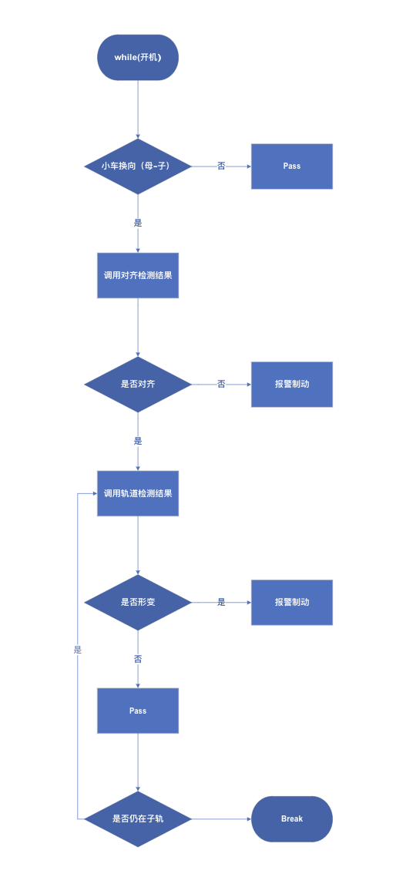

# 4.0 TOF轨道检测功能开发规划书

---

## 传感器原理

Time of Flight: 发射光脉冲 -> 单光子二极管

1. 材料表面粗糙度（漫反射能力）
2. 入射角度

## 传感器性能测试（6月6号）

经测试，VL53L8CX TOF传感器斜置检测时有如下特性

### I. 受目标左右两端障碍物干扰

观察发现，不与母道接轨的子道部分，两端存在金属挡板结构，材料与子道一致，对光的反射效果较强，导致对向左侧发射的光子被反射，严重干扰测试结果（图1&2、**输出结果已经经过双边滤波**）。经测验，粗糙材料也会对两侧射出光子有严重干涉。


在没有遮挡物的情况下对同材料轨道进行测试：


我们发现，撤掉遮挡物后，尽管由于测量角度的存在，所得数据中存在一定噪音，但是轨道轮廓清晰可见，并且能观察到检测到的是平滑斜面，与预期相符。

结论：传感器发射端两侧不能够有遮挡，具体干涉距离临界值待测。另外，FOV与说明书描述基本一致：(45)

| 距测量物距离[mm] | FOV[°] |
| :--------------: | :----: |
|        22        |   44   |
|        41        |   40   |
|        58        |   43   |

### II. 精度有限

经测量，横纵分辨率实际值比理论值表现更好，但仍然很差，桌面测试表明，在斜置60情况下，横纵分辨率在40mm左右。高度分辨率较好，一般10mm左右高物体在数据矩阵内会有可识别的动态区别。所以无法进行子轨左右/上下偏移的检测。也无法检测轨道上障碍物以及骑轨。

### III. 发射角度对测试结果有影响，但不影响整体数据形态

该传感器官方说明书中所提及的测量数据的测量方式皆为垂直测量，该测量方式得到的数据最有效（20mm-4000mm范围内）。垂直测试效果最好，但是测量范围非常有限，无法预测车前轨道状态。经测量，斜置传感器可以得出轨道轮廓，但会增加远端噪音。

## 检测流程



## 功能I：换向对齐检测

> - 功能定义：检测四向车换向后车轮是否处于轨道中心
> - Input：1个斜置TOF传感器数据
> - Return 小车偏移量 x毫米
>
> ```c++
> // pseudocode
> if ("换向") {
> 	getTof(*buf, id); // 读数据
>   arrangeTOFData(raw_data, A); // 解析数据
>   TrackDetect::check(A) // 检测数据有效性
>   TrackDetect::analyze(A) // 根据算法计算小车偏移(x [mm])
> }
> return x;
> ```
>
> ```c++
> // 偏移算法 TrackDetect
> // 双边滤波后较为理想的数据
> cv::Mat A = [1000 1000 1000 1000 1000 1000 1000 1000
>              1000 1000 1000 1000 1000 1000 1000 1000
> 						 700  200  200  200  200  200  700  700 
>              800  180  180  180  180  180  700  700  
>              750  160  160  160  160  160  700  700 
>              800. 150. 150  150  150. 150. 700  700
>              750. 130. 130. 130. 130  130. 700  700
>              730  100. 100. 100  100. 100. 700. 700];
> // 归一化
> cv::normalize(A, A_normalized, 0, 255, cv::NORM_MINMAX);
> 
> // 二值化
> cv::threshold(image8bit, binary, 60, 255, cv::THRESH_BINARY);
> ```
>
> 
>
> 
>
> 
>
> 
>
> 开发步骤
>
> 1. 传感器标定（确定理想位姿）
> 1. 
>
> **开发周期：**
>
> |   模块/任务    |  开始   |  结束  |           备注           |
> | :------------: | :-----: | :----: | :----------------------: |
> |      API       | 5月31号 | 6月7号 |         通信频率         |
> | MATLAB算法模拟 | 5月31号 | 6月7号 | 测试算法鲁棒性和抗噪能力 |
> |  C++算法实现   | 6月x号  | 6月x号 |                          |
> |      测试      |    x    |   x    |                          |

## 功能II：轨道形变监测

> - 功能定义：检测小车前方轨道是否存在弯曲/形变
> - Input：1个TOF传感器数据
> - Return 轨道形变矩阵[x, y]
>
> ```c++
> // pseudocode
> while (v_bot > 0 && 子道) {
> 	getTof(*buf, id); // 读数据
>   arrangeTOFData(raw_data, A); // 解析数据
>   RailInspect::check(A) // 检测数据有效性
>   TrackDetect(); // 需结合轨道偏移角度进行标定
>   RailInspect::analyze(A) // 根据算法计算轨道形变矩阵(x, y) x, y 为轨道异构处到机器人中心坐标[mm]
> }
> return x;
> ```
>
> ```c++
> // 轨道形变算法 RailInspect
> ...
> ```
>
> ### 迭代功能（对齐需求）
>
> 1. …
>
> **开发周期：**
>
> |   模块/任务    |  开始   |  结束  | 备注 |
> | :------------: | :-----: | :----: | :--: |
> |      API       | 5月31号 | 6月7号 |      |
> | MATLAB算法模拟 | 5月31号 | 6月7号 |      |
> |  C++算法实现   | 6月x号  | 6月x号 |      |
> |      测试      |    x    |   x    |      |

## 功能III：举升对接检测

> - 功能定义：检测小车与举升机对接前是否对齐
> - Input: 1个斜置TOF传感器数据
> - Return 举升对接检测矩阵[flag, d, $\alpha$]
>
> ```c++
> // pseudocode
> while (flag_transport) {
> 	getTof(*buf, id); // 读数据
>   arrangeTOFData(raw_data, A); // 解析数据
>   TransportCheck::check(A) // 检测数据有效性(是否检测到举升机) return flag;
>   TransportCheck::analyze(A) // 根据算法计算小车偏移和偏角 return x [mm], alpha [degree];
> }
> return [flag, x, alpha]; // flag:是否有举升机, x [mm]: 水平偏移量, alpha [degree]: 偏角
> ```
>
> ```c++
> // 举升对接检测算法
> ...
> ```
>
> ### 迭代功能（对齐需求）
>
> 1. …
>
> **开发周期：**
>
> |   模块/任务    | 开始  | 结束  | 备注 |
> | :------------: | :---: | :---: | :--: |
> |      API       | 6月号 | 6月号 |      |
> | MATLAB算法模拟 | 6月号 | 6月号 |      |
> |  C++算法实现   | 6月号 | 6月号 |      |
> |      测试      |       |       |      |

## 功能IV：轨道异物检测（待议）